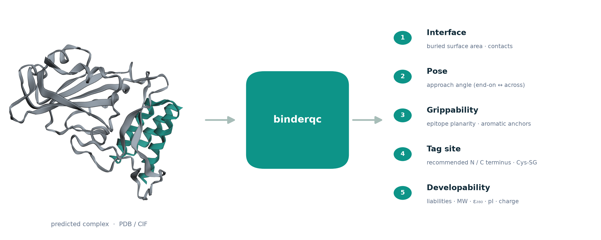

<h1 align="center">binderqc</h1>

<p align="center">
  Quality control and tag-site scoring for designed protein binders. Geometry and
  sequence only, one CSV row per binder, from a predicted complex.
</p>

<p align="center">
  <a href="https://pypi.org/project/binderqc/"></a>
  <a href="https://github.com/ssiddhantsharma/binderqc/actions/workflows/ci.yml"></a>
  <a href="https://opensource.org/licenses/MIT"></a>
  <a href="https://www.python.org/"></a>
</p>

<p align="center">
  
</p>

## Install

```bash
pip install binderqc
```

Python 3.10+. Pulls in `biotite`, `numpy`, and `pandas`. For development from
source: `pip install -e ".[test]"`.

## Usage

```bash
binderqc --binder-chains A --target-chains B --out out.csv complex.cif some_dir/
```

```python
from binderqc import score_structure
rows = score_structure("complex.pdb", binder_chains=["A"], target_chains=["B"])
```

Inputs are PDB/CIF files, globs, or directories. Leave `--binder-chains` off to
guess the binder as the shortest chain (20-250 aa, printed for each file);
`--target-chains` defaults to the remaining chains.

| flag | default | meaning |
|---|---|---|
| `--binder-chains` | auto-guess | comma-separated binder chain ids |
| `--target-chains` | all non-binder | comma-separated target chain ids |
| `--interface-cutoff` | `5.0` | heavy-atom contact distance (Å) |
| `--exposure-cutoff` | `0.25` | relSASA below which a terminus is buried |
| `--out` | `binderqc.csv` | output CSV path |
| `--fasta` | off | also write the QC-passing binders to this FASTA |

Example output for the bundled LCB1 minibinder (a few of the columns):

| recommended_tag | binder_bsa | epitope_planarity | epitope_aromatic_n | pi | qc_pass |
|---|---|---|---|---|---|
| C | 1021.4 | 3.21 | 11 | 4.17 | True |

Its `warnings` field reads "both termini ~equidistant from interface (ambiguous)",
a tag-site advisory, so `qc_pass` stays `True`.

## What it reports

Per binder chain:

- **Interface**: buried surface area, interface residue count, hydrogen-bond and
  salt-bridge counts, and a contact-packing density (a lightweight proxy for
  contact molecular surface).
- **Pose**: approach angle (end-on vs. lying across the surface).
- **Grippability**: epitope planarity, hydrophobic fraction, aromatic anchors.
- **Tag site**: recommended terminus (N/C) and the numbers behind it: relative
  SASA, CA-CA distance to the paratope, orientation, and a terminal cysteine's SG SASA.
- **Developability**: an SAP-style spatial aggregation score, sequence
  liabilities, GRAVY, pI, MW, ε₂₈₀.

A `warnings` column flags problems (small, flat, or anchorless interfaces; buried,
ambiguous, or interface-facing tag sites; hydrophobic sequences). `qc_pass` is
true when there are no quality warnings (tag-site advisories like an ambiguous
terminus do not count), and `--fasta` writes those binders.

<details>
<summary>Full column list</summary>

`pdb, binder_chain, target_chains, n_interface_res, binder_bsa, n_hbonds,
n_salt_bridges, interface_packing, approach_angle, epitope_planarity,
epitope_hydrophobic_frac, epitope_aromatic_n, nterm_resnum, nterm_resname,
nterm_relsasa, nterm_dist_to_interface, nterm_orientation, nterm_sg_sasa,
cterm_resnum, cterm_resname, cterm_relsasa, cterm_dist_to_interface,
cterm_orientation, cterm_sg_sasa, recommended_tag, mw, gravy, pi, ext_coeff_280,
sap_score, sequence_liabilities, warnings, qc_pass, binder_sequence`
</details>

## Tests

```bash
pip install -e ".[test]"
pytest
```

Runs against a bundled example, PDB 7JZU (the LCB1 minibinder on the SARS-CoV-2
RBD). LCB1 comes from Cao et al. (2020), which frames the problem binderqc
targets: the bottleneck is selecting good binders, not designing them.

> "…not in the de novo design of proteins with shape and chemical complementarity
> to the target surface, but in recognizing the best candidates."

In that work LCB1 buries ~1,000 Ų and forms "multiple hydrogen bonds and salt
bridges … consistent with the subnanomolar affinities". binderqc on 7JZU agrees:
1021 Ų buried area (Cao reports ~1,000 Ų), plus 2 salt bridges and 17 interface
polar contacts. The buried area matches; the polar-contact count is a rough
geometric proxy (no hydrogens or angles) that is consistent with "multiple", not
an exact H-bond count. See Cao et al., *De novo design of picomolar SARS-CoV-2
miniprotein inhibitors*, Science 370, 426-431 (2020),
[doi:10.1126/science.abd9909](https://doi.org/10.1126/science.abd9909).

`tests/pisa_correctness.py` is a separate script (not part of the unit tests). It
downloads 18 public complexes from RCSB and PDBePISA and checks the interface area
against PISA (r ~ 1.0, about 1% median error):

```bash
pip install -e ".[validation]"
python tests/pisa_correctness.py
```

## License

MIT
